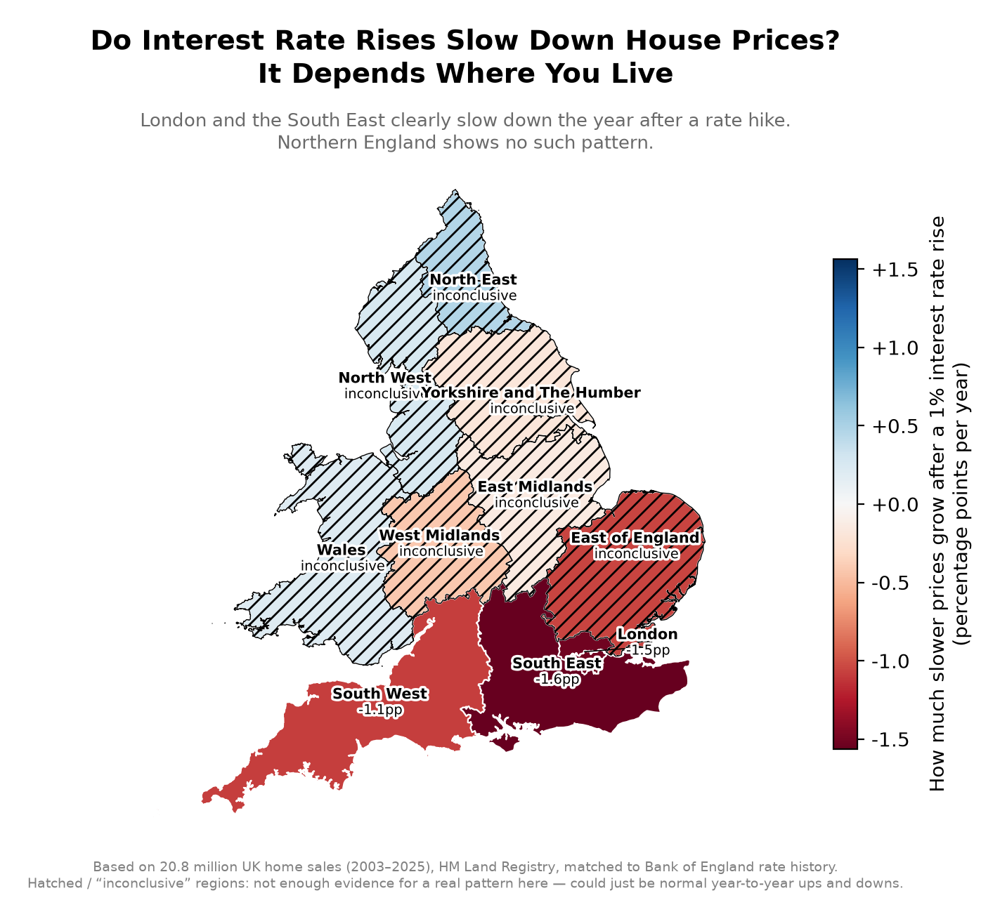

# Does the Bank of England's Interest Rate Affect Every Region the Same Way?

A hedonic pricing model and regional house-price index built from 20.8 million UK property
transactions (2003–2025), testing whether price growth reacts differently to Bank of England
base rate changes depending on where in the UK you live.

**Short answer: no.** London and the South East show a real, statistically significant
slowdown in price growth the year after a rate rise. Northern England shows no such pattern.



## Key finding

| Region | Price growth slowdown per 1% rate rise (1yr lag) | Statistically significant? |
|---|---|---|
| South East | −1.57 pp | Yes (p = 0.002) |
| London | −1.53 pp | Yes (p < 0.001) |
| South West | −1.09 pp | Yes (p = 0.025) |
| East of England | −1.06 pp | Borderline (p = 0.12) |
| West Midlands, Yorkshire, East Midlands | small, negative | No |
| Wales, North West, North East | ~0 | No |

A single national interest rate functions, in practice, like a regional policy lever — it
cools the South noticeably and barely touches the North. Full write-up of the methodology and
the caveats worth knowing before citing this is below.

## Methodology

**Data**: [HM Land Registry Price Paid Data](https://www.gov.uk/government/statistical-data-sets/price-paid-data-downloads)
(every residential sale in England & Wales, 2003–2026), joined to the
[ONS National Statistics Postcode Lookup](https://geoportal.statistics.gov.uk/) (postcode →
region) and the [Bank of England's Bank Rate history](https://www.bankofengland.co.uk/boeapps/database/Bank-Rate.asp).
20.8M of ~22.6M raw transactions survive cleaning (standard arm's-length sales only, excluding
non-market transfers and known PPD data-entry outliers — see `scripts/build_fact_table.py`).

**Model A — hedonic pricing model + regional price index.** PPD doesn't include bedroom count
or floor area, so — following the same approach used by the UK's official House Price Index —
price is modeled against property type, new-build status, tenure, and a full region×year fixed
effect:

```
log(price) = β·property_type + β·new_build + β·tenure + γ[region, year] + ε
```

`exp(γ[region, year])` is a mix-adjusted regional price index — i.e. it isolates genuine
like-for-like appreciation from compositional shifts (e.g. more flats selling one year than
the next). Fit on a 1M-row stratified sample (statsmodels OLS, HC1 robust SEs) for
computational tractability; results are consistent with re-sampling.

**Model B — rate-sensitivity by region.** Regressing raw price growth on the *same-year* rate
change gives the wrong sign — the BoE raises rates *because* the economy is overheating, so
contemporaneous rate hikes and price growth are confounded by reverse causality. Model B
instead regresses each region's annual mix-adjusted index growth (from Model A) on **last
year's** rate change, with a region-specific slope:

```
growth[region, t] = α[region] + β[region]·Δrate[t-1] + ε
```

This is the standard fix for monetary-policy-transmission studies, and it's what flips the
result from noise (all positive, none significant) to the real pattern reported above.

**Map**: static (matplotlib) and interactive (folium) choropleths over ONS ITL1 region
boundaries, `scripts/build_choropleth.py`.

## Limitations

- Only 3 of 10 regions reach conventional statistical significance (p < 0.05), with a 4th
  (East of England) borderline at p = 0.12 — the *direction* (South reacts, North doesn't) is
  consistent and robust, but exact magnitudes for the non-significant regions shouldn't be
  over-interpreted.
- The rate-sensitivity model is fundamentally a small-sample time-series result: 21 years of
  national rate data means one severe cycle (2008) and one hiking cycle (2022–23) are doing a
  lot of the identifying work.
- PPD has no bedroom count, floor area, or condition data — the hedonic model's R² (0.56) is
  reasonable given that constraint but leaves real variation unexplained.

## Repo structure

```
data/
  raw/        HM Land Registry, ONS, and BoE downloads (gitignored, ~4.6GB)
  staging/    DuckDB database + intermediate model outputs (gitignored)
  external/   small reference data: region code lookup, ONS boundary file
scripts/      the full pipeline, run in order (see below)
outputs/      final map deliverables (static PNG + interactive HTML)
```

## Reproducing this

```bash
python3.12 -m venv .venv
source .venv/bin/activate
pip install -r requirements.txt

python scripts/download_ppd.py         # ~3-4GB, 24 yearly files
python scripts/download_nspl.py        # ~769MB
python scripts/download_boe_rate.py    # <100KB
python scripts/load_to_duckdb.py       # stages raw CSVs into DuckDB
python scripts/build_fact_table.py     # joins + cleans -> fct_sales
python scripts/fit_hedonic_model.py    # Model A: hedonic model + regional index
python scripts/fit_rate_sensitivity_model.py  # Model B: rate-sensitivity by region
python scripts/build_choropleth.py     # final map
```

## Testing

`tests/test_data_quality.py` holds regression checks for real bugs found while building this
(a silently-dropped region on a placeholder ONS code, a coordinate-reference-system mismatch
that left the interactive map blank, and a data-quality bound on the cleaned price field).
These validate the pipeline's own output, not pure functions, so run them after the pipeline
above rather than on a fresh clone:

```bash
pytest tests/ -v
```

## Stack

Python 3.12, DuckDB, pandas, statsmodels, geopandas, folium, pytest.

## Data attribution

Contains HM Land Registry data © Crown copyright and database right 2021, and ONS/OS
geographic data, licensed under the [Open Government Licence v3.0](http://www.nationalarchives.gov.uk/doc/open-government-licence/version/3/).
Bank Rate history from the Bank of England.

## License

MIT (code only — see [LICENSE](LICENSE) and "Data attribution" above for the underlying data's
own licensing).
